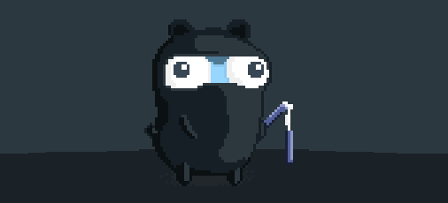
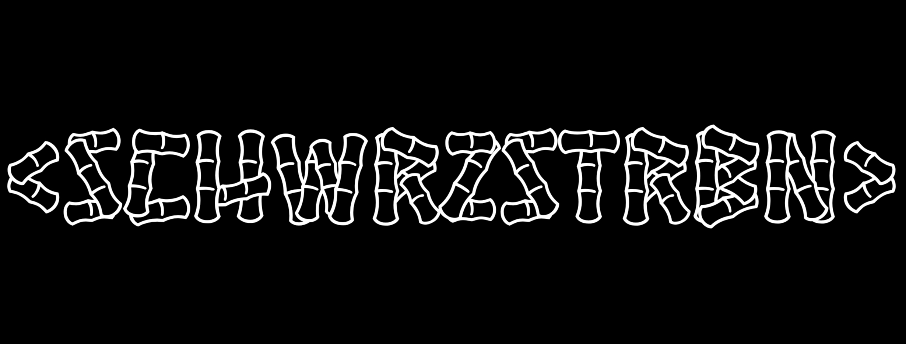

<!-- 

 -->

<!-- 

   
  &nbsp;&nbsp;
  
  &nbsp;&nbsp;
  
  &nbsp;&nbsp;
  

 -->

<!-- --- -->

<!--  -->

<!--
<h1 align="center">
   Hi I'm Sean - aka <a href="https://seanmiranda.netlify.app" target="_blank">schwarz sterben</a> 💀
</h1>
-->

<!--  -->

   
<h2 align="center">Support 💀</h2>

<!--

-->
<!--
## Connect with me:

[][website]
[][twitter]
[][linkedin]
[][instagram]
-->

<!--

-->

<!-- ### Languages and Tools:

[]
[]
[]
[]
[]
[]
[]

  -->

<!--
**schwarz-sterben/schwarz-sterben** is a ✨ _special_ ✨ repository because its `README.md` (this file) appears on your GitHub profile.

Here are some ideas to get you started:

- 🔭 I’m currently working on ...
- 🌱 I’m currently learning ...
- 👯 I’m looking to collaborate on ...
- 🤔 I’m looking for help with ...
- 💬 Ask me about ...
- 📫 How to reach me: ...
- 😄 Pronouns: ...
- ⚡ Fun fact: ...
-->

[website]: https://seanmiranda.netlify.app
[twitter]: https://twitter.com/schwrzstrbn
[instagram]: https://instagram.com/schwrzstrbn
[linkedin]: https://linkedin.com/in/schwrzstrbn
